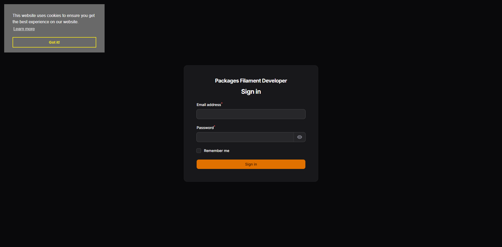
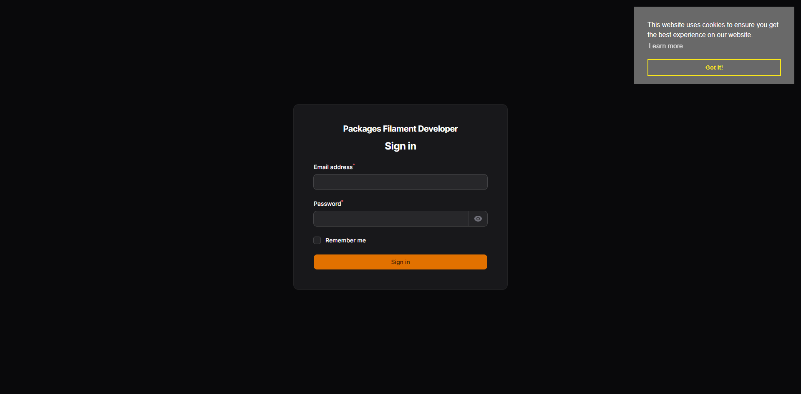
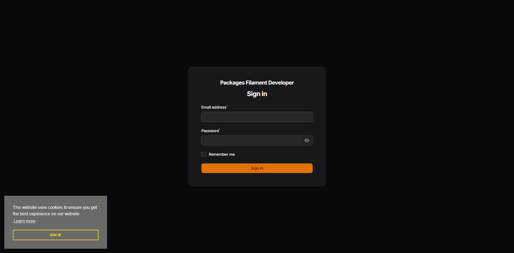
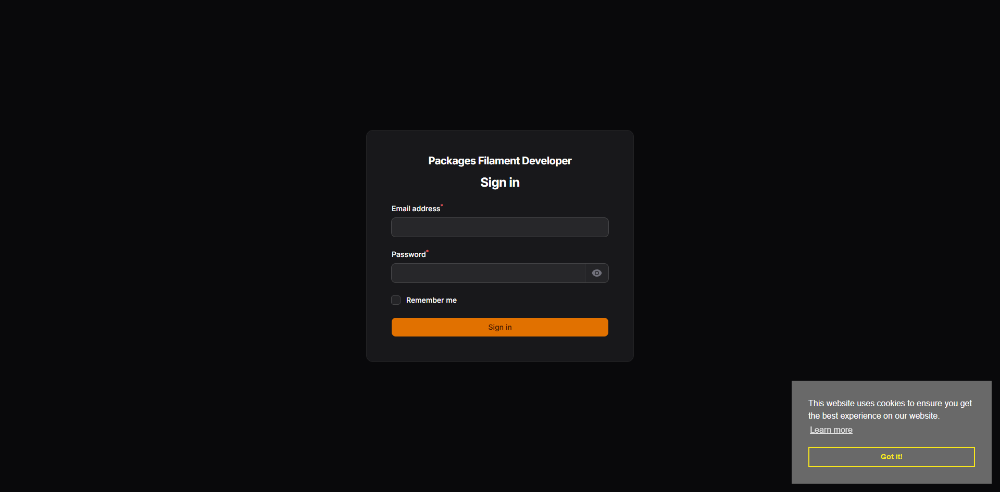

<div class="filament-hidden">


</div>

# Filament Cookie Consent

[](https://packagist.org/packages/jeffersongoncalves/filament-cookie-consent)
[](https://github.com/jeffersongoncalves/filament-cookie-consent/actions?query=workflow%3A"Fix+PHP+code+styling"+branch%3A3.x)
[](https://packagist.org/packages/jeffersongoncalves/filament-cookie-consent)

This Filament package provides a simple and elegant way to implement cookie consent on your website, ensuring compliance with privacy regulations like GDPR and CCPA. It offers a clean and customizable interface, allowing you to easily manage and display cookie consent banners and preferences.

## Compatibility

| Package Version                                                               | Filament Version |
|-------------------------------------------------------------------------------|------------------|
| [1.x](https://github.com/jeffersongoncalves/filament-cookie-consent/tree/1.x) | 3.x              |
| [2.x](https://github.com/jeffersongoncalves/filament-cookie-consent/tree/2.x) | 4.x              |
| [3.x](https://github.com/jeffersongoncalves/filament-cookie-consent/tree/3.x) | 5.x              |

## Installation

You can install the package via composer:

```bash
composer require jeffersongoncalves/filament-cookie-consent
```

## Usage

This package automatically integrates cookie consent functionality into your Filament panels. Once installed, the cookie consent banner will be automatically displayed on all Filament panel pages without any additional configuration.

### Configuration

You can customize the appearance and behavior of the cookie consent banner by editing the `config/cookie-consent.php` file.

```php
return [
    'css' => 'https://cdn.jsdelivr.net/npm/cookieconsent@3/build/cookieconsent.min.css',
    'js' => 'https://cdn.jsdelivr.net/npm/cookieconsent@3/build/cookieconsent.min.js',
    'content' => [
        'href' => null,
        'close' => '&#x274c;',
    ],
    'palette' => [
        'popup' => [
            'background' => '#696969',
            'text' => '#FFFFFF',
            'link' => '#FFFFFF',
        ],
        'button' => [
            'background' => 'transparent',
            'border' => '#f8e71c',
            'text' => '#f8e71c',
        ],
        'highlight' => [
            'background' => '#f8e71c',
            'border' => '#f8e71c',
            'text' => '#000000',
        ],
    ],
    'position' => 'bottom-left', // top-left, top-right, bottom-left, bottom-right
    'theme' => 'block', // block, edgeless, classic
];
```

### Screenshots

Screenshots using this package in the admin panel provider.

| Top Left | Top Right |
| :---: | :---: |
|  |  |
| **Bottom Left** | **Bottom Right** |
|  |  |

### Admin Panel Provider

To use this package, you need to register the `CookieConsentServiceProvider` in your `composer.json` (automatically done via Laravel package discovery) and ensure it's available for your Filament panels.

### How it works

This package extends the [jeffersongoncalves/laravel-cookie-consent](https://github.com/jeffersongoncalves/laravel-cookie-consent) package specifically for Filament panels. It automatically registers render hooks that inject the cookie consent templates into your Filament panel pages:

- Cookie consent scripts are automatically added to the `<head>` section
- Cookie consent banner is automatically added to the end of the `<body>` section

No manual template inclusion is required when using this Filament package.

## Testing

```bash
composer test
```

## Changelog

Please see [CHANGELOG](CHANGELOG.md) for more information on what has changed recently.

## Contributing

Please see [CONTRIBUTING](.github/CONTRIBUTING.md) for details.

## Security Vulnerabilities

Please review [our security policy](../../security/policy) on how to report security vulnerabilities.

## Credits

- [Jèfferson Gonçalves](https://github.com/jeffersongoncalves)
- [All Contributors](../../contributors)

## License

The MIT License (MIT). Please see [License File](LICENSE.md) for more information.
